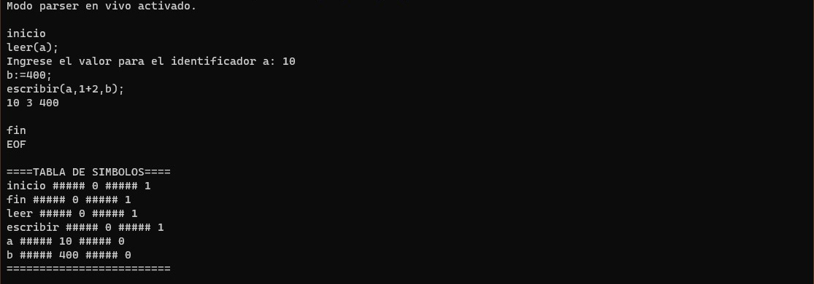
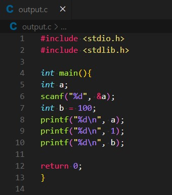
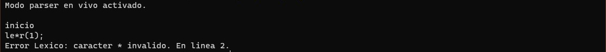
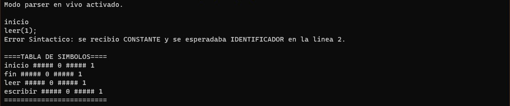
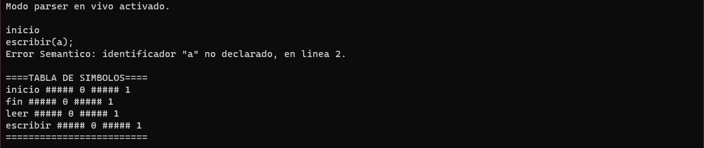

# TP Flex - Bison | Sintaxis y Semántica de los Lenguajes

## Curso K2006

## Equipo de desarrollo

- ENCINAS MAXIMILIANO
- IDAÑEZ LUCÍA
- MOYANO LAUTARO 
- PEDACI MARCOS

## Compilar
Para compilar el programa ejecute el archivo "make.bat".\
Debe asegurarse de poseer instalado flex y bison.

## Instrucciones
Uso programa.exe [OPCIONES]\
&nbsp; -?, -H Presenta el menu de ayuda en pantalla.\
&nbsp; -l Activa el parser en vivo (A medida que se ingresan caracteres se analiza de forma lexica, sintactica y semantica).\
&nbsp; -f [archivo] Especifica el nombre del archivo a parserar (Similar a -l pero la entrada de caracteres es desde un archivo).\
&nbsp; -c [archivo] Especifica el nombre del archivo a parserar y convertir a c.

## Rutinas semanticas
- Verificacion de declaracion de identificadores
- Operaciones de suma y resta
- Conversion de micro a C

## Capturas
### Programa Micro

### Programa C generado

### Error Lexico

### Error Sintactico

### Error Semantico

